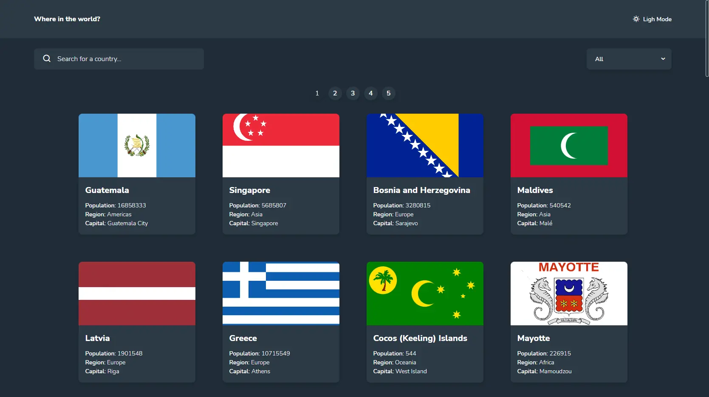
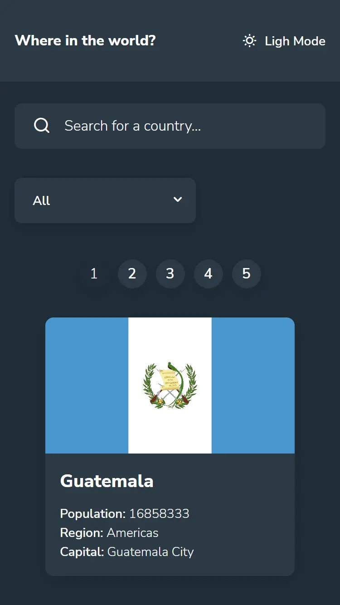

# Frontend Mentor - REST Countries API with color theme switcher solution

This is a solution to the [REST Countries API with color theme switcher challenge on Frontend Mentor](https://www.frontendmentor.io/challenges/rest-countries-api-with-color-theme-switcher-5cacc469fec04111f7b848ca). Frontend Mentor challenges help you improve your coding skills by building realistic projects.

## Table of contents

- [Frontend Mentor - REST Countries API with color theme switcher solution](#frontend-mentor---rest-countries-api-with-color-theme-switcher-solution)
  - [Table of contents](#table-of-contents)
  - [Overview](#overview)
    - [The challenge](#the-challenge)
    - [Screenshot](#screenshot)
    - [Links](#links)
    - [Built with](#built-with)
  - [Author](#author)
  - [Installation](#installation)
  - [Usage](#usage)

## Overview

### The challenge

Users should be able to:

- See all countries from the API on the homepage
- Search for a country using an `input` field
- Filter countries by region
- Click on a country to see more detailed information on a separate page
- Click through to the border countries on the detail page
- Toggle the color scheme between light and dark mode _(optional)_

### Screenshot

Desktop Version



Mobile Version



### Links

- Solution URL: [GitHub](https://github.com/StalinAM/countries-api.git)
- Live Site URL: [StalinAM](https://space-tourism-svam.vercel.app/)

### Built with

- [Vitejs](https://vitejs.dev/)
- [react-router-dom](https://reactrouter.com/en/main)
- [API](https://restcountries.com/)
- Semantic HTML5 markup
- CSS custom properties
- Flexbox
- CSS Grid
- JavaScript

## Author

- GitHub - [StalinAM](https://github.com/StalinAM)
- Frontend Mentor - [@StalinAM](https://www.frontendmentor.io/profile/StalinAM)

## Installation

To install the project, follow these steps:

- Clone the repository:

```bash
git clone https://github.com/StalinAM/countries-api.git
```

- Install dependencies:

```bash
npm install
# or
yarn install
```

## Usage

To start the development server, run the following command in the terminal:

```bash
npm run dev
# or
yarn dev
```
